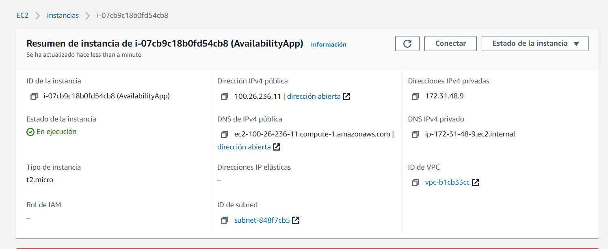

# Tutorial Capacidades de Autoescalamiento de Amazon Web Services.

## Definición del problema
El auto escalamiento es muy útil en problemas que requieran gran cantidad de procesamiento.

El problema escogido fue el de la sucesión de Padovan de manera recurrente.

## Solución
Una vez tenemos el problema debemos idear una forma de resolverlo, como en esta sucesión se nos puede presentar un número demasiado grande usaremos la clase BigInteger, que nos permite manejar números de grandes longitudes.

También se usó el framework spark para desplegar un servicio web que reciba un número en los parámetros de una consulta web y creé una instancia de PadovanNumber para calcular el valor de la sucesión. Creamos un formulario simple para probar su funcionamiento.

Este servicio esta deplegado en el puerto 5001.

**Función:**
Esta función se encuentra en la clase [PadovanNumber.java](src/main/java/edu/escuelaing/arep/services/PadovanNumber.java)

    public BigInteger getNumber(int number) throws PadovanException {
        BigInteger answer = BigInteger.ZERO;

        if (number == 0  || number == 1  || number ==2){
            answer = BigInteger.ONE;
        }else if(number>2){
            BigInteger p1 = getNumber(number-2);
            BigInteger p2 = getNumber(number-3);
            answer = p1.add(p2);
        }else{
            throw new PadovanException("Negative Number");
        }

		return answer;
	}

**Consulta Get:**

    private static Object getPadovanNumber(Request req, Response res) {
        PadovanNumber pNumber = new PadovanNumber();
        String s = req.queryParams("number");
        int number = Integer.parseInt(s);
        BigInteger answer;
        try {
            answer = pNumber.getNumber(number);
            return answer;
        } catch (PadovanException e) {
            res.status(400);
            return e.getMessage();
        }
    
    }

## Depliegue en AWS EC2
Amazon Elastic Compute Cloud (Amazon EC2) es un servicio web que proporciona capacidad informática en la nube segura y de tamaño modificable. Está diseñado para facilitar a los desarrolladores el uso de la informática en la nube a escala de la Web.

Los usuarios pueden alquilar maquinas virtuales conocidas como instancias en los cuales pueden ejecutar sus propias aplicaciones.

Para desplegarlo los haremos de la siguiente manera:

### Crear la instancia

1. Buscamos el servicio de EC2 en AWS y accedemos a él.
2. Después buscamos el botón de lanzar instancia, se verá así: 

    

3. Escogemos un Amazon Machine Image (AMI), para este tutorial se escogio el siguiente:

    

4. Después se debe escoger la instancia, aquí usaremos la que aparece como Free Tier.

    

5. Dejaremos todos los pasos siguientes por defecto hasta el 6 paso, configurar el grupo de seguridad, Podemos crear uno nuevo o usar uno existente. Aquí usaremos uno existente, lo importante es que los puertos coincidan con los que usaran los servicios.
    
    

6. Cuando lanzamos la instacia nos pide escoger un para de llaves, pueden ser unas ya creadas o podemos crearlas. Aquí crearemos un par y descargaremos las llaves para poder acceder a la instancia de manera remota.
    
    

7. Finalmente se podemos lanzar la instancia y acceder a ella.

### Ejecutar el servicio en la instancia EC2.
En la sección de instancias de AWS ya deberia aparecer la maquina que acabamos de crear.

1. Cuando revisamos la instancia podemos ver toda su información. Lo mas importante son las direcciones ip y la url pública.
    
    

2. Para acceder a la maquina nos aseguramos de que la llave que descargamos tenga permisos 400, con chmod 400 en un ambiente linux.

    Accedemos con el cliente sh de la siguiente manera: 

        ssh -i "AvailabilityApp.pem" ec2-user@ec2-100-26-236-11.compute-1.amazonaws.com
    
    También puede revisar la opción de conectar que le aparece al seleccionar una instancia, esta le explicara tambien como conectarse y le dara el comando exacto con ssh.

    

    Después de acceder se debe ejecutar el siguiente comando:

        sudo yum update -y

3. Ahora instalamos git. En la maquina usada en este tutorial puede hacerlo con el siguiente comando:

        sudo yum install git -y
        
    Luego usaremos git para descargar la solución desde este repositorio hasta la instancia EC2. Lo descargamos de la siguiente manera:

        git clone https://github.com/Ricar8o/AREP-Lab07-AvailabilityApp.git

4. Ahora accedemos a la carpeta del repositorio y para ejecutarlo debemos installar java y maven. En nuestra maquina lo hacemos de la siguiente manera

        sudo yum install maven -y

    Con este comando también debería haber descargado java, de lo contrario debe buscar como instalarlo en el sistema operativo de si instancia.

5. Lo compilamos con Maven 

    Para ejecutar todas las fases usaremos el comando:

        mvn package

6. Ahora podemos ejecutarlo con el comando:

        java -cp target/classes/:target/dependency/* edu.escuelaing.arep.availability.app.SparkWebServer

7. Comprobamos que el servicio si se este ejecutando accediendo a la url pública de la instancia y el puerto en un navegador.

    
    

Con las teclas "CTRL" + "C" dejará de ejecutarlo.

## Ejecutar servicio al inicio.
Ahora vamos a configurar nuestra maquina para que inicio el servicio al arrancar la instancia.

1. Ejecutamos el siguiente comando:

        sudo chmod +x /etc/rc.d/rc.local 
2. Ahora agregamos al final el comando de java necesario para ejecutar nuestro servicio, puede usar editores como nano o vim. Guardamos los cambios y verificamos que se haya guardado correctamente.

    

3. Reiniciamos la instancia y verificamos en el navegador que el servicio se ejecute en el arranque.

    

## Crear un AMI a partir de esta máquina.
1. Al seleccionar una instancia en el panel de instancias vemos varias opciones en la parte superior del panel. Damos click en acciones, images and templates y crear imagen. 
    
    
2. Ahora le pondremos un nombre y una descripción:

    

## Desplegar solución en un grupo de autoescalamiento.

### Configuración de lanzamiento.

1.  Vamos a crear una configuración de lanzamiento. En el panel de navegación, en AUTO SCALING, escogemos Launch Configurations (Configuraciones de lanzamiento).

    

    Esto nos llevara a un panel donde podemos crear la configuración de lanzamiento a partir de la AMI que creamos.

    

2. Para crear la configuración de lanzamiento debemos indicarle un nombre, la imagen y un tipo de instancia, para ese caso lo hacemos de la siguiente manera:

    

3. Ahora definimos el grupo de seguridad y el par de llaves con las que accederemos a las instancias. En este tutorial se escogieron unas ya existentes pero siempre puede crear unas nuevas si lo desea.

    

    

### Balanceador de carga .
Un balanceador de carga es util para distribuir peticiones web o mensajes entre una red.
1. Para crearlo en el panel de EC2 vamos a la sección Equuilibrio de carga y damos click en balanceo de carga.

    

2. Seleccionamos crear Balanceo de Carga y tenemos varias opciones para crearlo, escogemos la opción Application Load Balancer. 

    

3. En el paso 1 indicamos el nombre y las subredes en varias zonas de disponibilidad.

    

4. Escogemos el grupo de seguridad que controlara el trafico hacia el balanceador de carga y nos aseguramos de que tenga el puerto 80 en las reglas de entrada.

    

4. Por ultimo definimos el nombre y el puerto del grupo objetivo, 5001 es el puerto por el que se ejecuta este servicio.

    

### Auto Scaling Group.
Un grupo de Auto Scaling es una colección de instancias EC2 y el componente básico de Amazon EC2 Auto Scaling. 

1. Una vez creada ya creada la configuración de lanzamiento podemos crear un grupo Auto Scaling.

    

2. Escogemos un nombre para el grupo y damos a siguiente.

    

3. Dejamos la configuración VPC que aparece, ya que AWS se encarga de que esta proporcione conexión según la región donde que tenga definida y escogemos subredes en varias zonas de disponibilidad para lograr una alta disponibilidad.

    

4. En el paso tres podemos habilitar un balanceador de carga, lo habilitamos y escogemos el grupo objetivo.

    

5. En el paso 4 definimos la capacidad maxima a 3 y seleccionamos omitir para revisar. 

    

## Verificando 

Ahora se accede al servicio a través de la dirección publica del balanceador de carga.

Después de hacer la petición el balanceador de carga creo una instancia en el grupo para manejar las peticiones.

En el balanceador de carga podemos ver más detalladamente que recibe los requests y si es necesario creara más instancias para manejar las peticiones.

